<div align="center">

# ✦ OmniContent AI

### Upload once. Publish everywhere.

**The AI-native content distribution engine that atomizes a single long-form video into clips, blog articles, social posts, and platform-native assets — ready to ship in minutes.**

[](https://omnicontent-ai.arpitverma.me)
&nbsp;
[](https://nextjs.org/)
&nbsp;
[](https://www.typescriptlang.org/)
&nbsp;
[](https://ai.google.dev/)

</div>

---

## 📺 Demo

https://github.com/user-attachments/assets/63a4d39c-e729-447e-915e-0840bba509dd

---

## ⚡ What It Does

OmniContent AI is a full-stack SaaS platform that automates the entire content repurposing pipeline. Give it a **YouTube URL** or **upload a video file**, and it generates:

| Output | Description |
| :--- | :--- |
| **📝 Blog Article** | SEO-optimized, publication-ready Markdown with AI-generated hero imagery (via Pollinations AI) |
| **📋 Summary** | Concise one-paragraph overview of the entire video |
| **🎬 Short-form Clips** | "Viral moment" clips with burned-in animated captions (ASS subtitles), reformattable to 9:16, 1:1, or 4:5 |
| **💼 LinkedIn Post** | Hook-driven professional post with emojis & hashtags |
| **🐦 Twitter/X Thread** | Numbered tweet thread under 280 chars each, with a CTA |
| **📜 Transcript** | Timestamped, structured transcript |

All assets are editable in-app, translatable to any language, and publishable to connected platforms with **one click**.

---

## 🔑 Key Features

### 🤖 AI-Powered Content Generation
Leverages **Google Gemini 2.5 Flash** (with automatic model failover chain across `gemini-3.1-flash-lite`, `gemini-2.5-flash-lite`, `gemini-3-flash`) to analyze video and generate all content assets in a single pipeline. Includes **AI-powered JSON repair** for resilient output parsing.

### 🎬 Automated Video Clipping & Captions
Identifies viral moments, trims clips using **FFmpeg**, and burns in **word-level animated captions** (ASS subtitle format) with multiple caption styles: `default`, `highlight`, and `karaoke`. Supports custom timeframe constraints for targeted clip generation.

### ✏️ Premium In-App Editor
Full-featured Markdown editor with:
- **Rich text formatting** toolbar (Bold, Italic, Headings, Blockquotes, Code blocks)
- **Undo/Redo** with persistent session history
- **Auto-saving** to the cloud with debounced writes and accidental-clear protection
- **Image upload** support (local device + AI-generated via Pollinations API)
- **Revert to original** draft with Gemini-powered transcript-based regeneration
- Hero image prompt customization

### 📤 One-Click Cross-Platform Publishing
Directly publish to connected platforms via OAuth:
- **LinkedIn** — Full OAuth 2.0 flow with token refresh, dual API fallback (ugcPosts + REST Posts)
- **YouTube Shorts** — Resumable upload API with video buffer streaming
- **Twitter/X** — Thread publishing via GetXAPI with reply chaining
- Publish history tracking with per-platform status (SUCCESS/FAILED)

### 🖼️ On-Demand Aspect Ratio Reformatting
Reformat any clip to **9:16** (Reels/Shorts), **1:1** (Feed), or **4:5** (Instagram) on the fly — processed via a dedicated RabbitMQ queue with real-time WebSocket notifications on completion.

### 🌐 Multi-Language Translation
Translate any generated text asset into a different language with a single click using Gemini — with flag-based toggle UI to switch between original and translated views.

### ⚡ Real-Time Experience
- Live **typewriter text animation** with per-session playback tracking
- **WebSocket notifications** (Socket.IO) for clip reformatting and job completion
- **SWR-powered** dashboard with auto-refresh and optimistic updates
- **Stale job detection** (15-min threshold) with visual indicators

### 🔒 Security & Resilience
- **Clerk authentication** with session-based token validation
- **SSRF protection** — URL validation blocking internal hosts and private IP ranges
- **File-type validation** — MIME type + magic byte verification for uploads
- **Path traversal protection** on file serving endpoints
- **Timing-safe** internal API secret comparison
- **Input sanitization** for FFmpeg shell commands

### ✨ Tiered Free / Premium Plans
- Free plan: 3 clips, watermarked videos
- Pro plan: 6 clips, no watermark, full editing access

---

## 🏗️ Architecture

```
┌──────────────────┐        ┌───────────────────┐         ┌────────────────────┐
│    Frontend      │◄──────►│     Backend       │◄──────► │     Worker         │
│  Next.js 15      │  REST  │  Express + Socket │ AMQP    │  FFmpeg + Gemini   │
│  React 19        │  +WS   │  Clerk Auth       │         │  yt-dlp            │
│  Tailwind CSS    │        │  Mongoose         │         │  Cloudinary        │
│  Framer Motion   │        │  RabbitMQ Producer│         │  RabbitMQ Consumer │
└──────────────────┘        └───────────────────┘         └────────────────────┘
         │                           │                            │
         │                           ▼                            │
         │                    ┌─────────────┐                     │
         │                    │   MongoDB   │◄────────────────────┘
         │                    └─────────────┘
         │                           │
         └──────────────────►┌───────┴───────┐
                             │  Cloudinary   │
                             │  (Media CDN)  │
                             └───────────────┘
```

The system runs as a **distributed monorepo** with three independently deployable services connected via **RabbitMQ message queues**:

| Service | Role | Queues |
| :--- | :--- | :--- |
| **Frontend** | Next.js SSR + client SPA | — |
| **Backend** | REST API, WebSocket hub, OAuth handler, job producer | Publishes to `content_jobs`, `reformatting_jobs` |
| **Worker** | Video download, AI analysis, FFmpeg processing, Cloudinary upload | Consumes `content_jobs` → produces `video_processing_jobs`, also consumes `reformatting_jobs` |

---

## 🛠️ Tech Stack

<table>
<tr><td><b>Category</b></td><td><b>Technologies</b></td></tr>
<tr><td>Frontend</td><td>Next.js 15, React 19, TypeScript, Tailwind CSS 4, Shadcn/UI, Framer Motion, SWR, Socket.IO Client, React Player, React Markdown</td></tr>
<tr><td>Backend</td><td>Node.js, Express 5, TypeScript, Clerk, Mongoose, Socket.IO, RabbitMQ (amqplib), Multer, Archiver, Cloudinary SDK</td></tr>
<tr><td>Worker</td><td>Node.js, TypeScript, Google GenAI SDK, Clerk SDK, FFmpeg, yt-dlp, Cloudinary SDK, Mongoose</td></tr>
<tr><td>AI/ML</td><td>Google Gemini 2.5 Flash (primary), Gemini 3.x Flash (fallback chain), Vercel AI SDK, Pollinations AI (image gen)</td></tr>
<tr><td>Database</td><td>MongoDB with Mongoose ODM</td></tr>
<tr><td>Infrastructure</td><td>Docker, RabbitMQ, Cloudinary CDN, Render (deployment)</td></tr>
<tr><td>Auth</td><td>Clerk (SSO, session management, plan metadata)</td></tr>
</table>

---

## 🚀 Getting Started

### Prerequisites

- **Node.js** v18+
- **Docker** (for MongoDB & RabbitMQ)
- API keys: [Google AI Studio](https://aistudio.google.com/), [Clerk](https://clerk.com/), [Cloudinary](https://cloudinary.com/)
- `ffmpeg` and `yt-dlp` installed locally (or use the Worker Dockerfile)

### 1. Clone & Install

```bash
git clone https://github.com/arpitboss/Omnicontent-ai.git
cd omnicontent-ai
```

Install dependencies for each package:

```bash
cd packages/frontend && npm install && cd ..
cd backend && npm install && cd ..
cd worker && npm install && cd ../..
```

### 2. Start Infrastructure

```bash
docker run -d --name omni-mongo -p 27017:27017 mongo
docker run -d --name omni-rabbit -p 5672:5672 -p 15672:15672 rabbitmq:3-management
```

### 3. Configure Environment Variables

**`packages/frontend/.env.local`**
```env
NEXT_PUBLIC_CLERK_PUBLISHABLE_KEY=pk_test_...
CLERK_SECRET_KEY=sk_test_...
NEXT_PUBLIC_API_URL=http://localhost:8080
```

**`packages/backend/.env`**
```env
MONGO_URI=mongodb://localhost:27017/omnicontent
CLERK_SECRET_KEY=sk_test_...
GEMINI_API_KEY=your_gemini_api_key
RABBITMQ_URL=amqp://localhost
FRONTEND_URL=http://localhost:3000
INTERNAL_API_SECRET=your_random_secret
CLOUDINARY_CLOUD_NAME=your_cloud_name
CLOUDINARY_API_KEY=your_cloudinary_key
CLOUDINARY_API_SECRET=your_cloudinary_secret
```

**`packages/worker/.env`**
```env
MONGO_URI=mongodb://localhost:27017/omnicontent
CLERK_SECRET_KEY=sk_test_...
GEMINI_API_KEY=your_gemini_api_key
RABBITMQ_URL=amqp://localhost
BACKEND_URL=http://localhost:8080
INTERNAL_API_SECRET=your_random_secret
CLOUDINARY_CLOUD_NAME=your_cloud_name
CLOUDINARY_API_KEY=your_cloudinary_key
CLOUDINARY_API_SECRET=your_cloudinary_secret
```

### 4. Run All Services

Open three terminal windows:

```bash
# Terminal 1 — Frontend (http://localhost:3000)
cd packages/frontend && npm run dev

# Terminal 2 — Backend API (http://localhost:8080)
cd packages/backend && npm run dev

# Terminal 3 — Worker (processes jobs from RabbitMQ)
cd packages/worker && npm run dev
```

### 5. Worker with Docker (recommended for video processing)

```bash
cd packages/worker
docker build -t omnicontent-worker .
docker run --env-file .env --network host omnicontent-worker
```

---

## 📂 Project Structure

```
omnicontent-ai/
├── packages/
│   ├── frontend/          # Next.js 15 application
│   │   ├── app/           # App router pages (dashboard, create, status, etc.)
│   │   ├── components/    # UI components (hero, editor, publish-hub, etc.)
│   │   ├── context/       # React contexts (theme, typewriter)
│   │   ├── hooks/         # Custom hooks (typewriter, toast, mobile)
│   │   └── lib/           # Utilities
│   ├── backend/           # Express.js REST API + WebSocket server
│   │   ├── src/
│   │   │   ├── routes/    # contentRoutes, publishRoutes
│   │   │   ├── models/    # Mongoose schemas (Content, SocialAccount)
│   │   │   ├── config/    # Database connection
│   │   │   └── utils/     # Cloudinary config
│   │   └── Dockerfile
│   └── worker/            # Background job processor
│       ├── src/
│       │   ├── aiService.ts    # Gemini video analysis + failover
│       │   ├── services/       # FFmpeg video processing + captioning
│       │   ├── models/         # Shared Mongoose schemas
│       │   └── utils/          # JSON repair, time parsing, Cloudinary
│       └── Dockerfile
└── README.md
```

---

## 🔗 API Endpoints

| Method | Endpoint | Description |
| :--- | :--- | :--- |
| `POST` | `/api/v1/content/atomize` | Submit a URL for atomization |
| `POST` | `/api/v1/content/atomize-file` | Upload a video file for atomization |
| `GET` | `/api/v1/content` | List all user content |
| `PUT` | `/api/v1/content/:id` | Update generated content (edit mode) |
| `POST` | `/api/v1/content/:id/translate` | Translate content text |
| `POST` | `/api/v1/content/:id/revert` | Revert to original draft |
| `POST` | `/api/v1/content/:id/regenerate` | Force regeneration from transcript |
| `POST` | `/api/v1/content/:id/clips/:clipId/reformat` | Reformat clip aspect ratio |
| `GET` | `/api/v1/content/:id/export-all` | Export all assets as ZIP |
| `DELETE` | `/api/v1/content/:id` | Delete a content job |
| `POST` | `/api/v1/publish/connect/:platform` | Initiate OAuth for platform |
| `POST` | `/api/v1/publish/linkedin/:id` | Publish to LinkedIn |
| `POST` | `/api/v1/publish/youtube/:id/:clipId` | Upload to YouTube Shorts |
| `POST` | `/api/v1/publish/twitter/:id` | Publish thread to Twitter/X |

---

## 🧪 Content Processing Pipeline

```mermaid
flowchart LR
    A[User uploads video/URL] --> B[Backend validates & creates job]
    B --> C[RabbitMQ: content_jobs]
    C --> D[Worker downloads video]
    D --> E[Gemini 2.5 Flash analyzes video]
    E --> F[Text assets saved to MongoDB]
    F --> G[RabbitMQ: video_processing_jobs]
    G --> H[FFmpeg clips + captions + reformat]
    H --> I[Upload to Cloudinary CDN]
    I --> J[Status → COMPLETE]
    J --> K[WebSocket notifies frontend]
```



---

## 📜 License

This project is licensed under the **MIT License** — see the [LICENSE](LICENSE) file for details.

---

<div align="center">
  <sub>Built with ☕ by <a href="https://arpitverma.me">Arpit Verma</a></sub>
</div>
